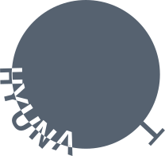
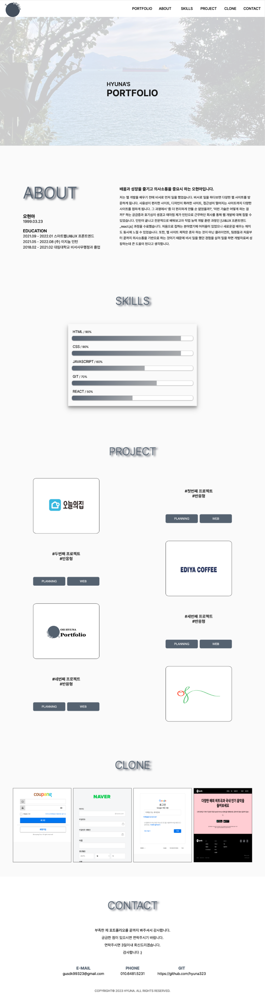

#  HYUNA portfolio
## 포트폴리오 소개
- 필요한 정보만 전달하기 위해 깔끔한 디자인이 목적
- 간단한 소개, skill, 그 동안 만들은 project, clone coding, contact part로 나눠서 제작
- 320px, 768px, 1280px, 1440px, 1920px을 반응형으로 제작

## 로고 소개

- 이름을 활용하여 한눈에 알아보기 쉽고 유니크하게 로고를 만들고자 함
- 오현아라는 이름을 한글과 영어를 이용하여 로고 제작
- '오' + 'hyuna'를 사용하여 이와 같은 로고 생성

## 사용기술
- HTML
- CSS
- JavaScript

## 보완사항
- 리액트를 공부 시작 단계에 제작하여 아직 "react" 적용 포트폴리오를 만들지 못했음  
-> 리액트를 추가적으로 공부하여 리액트를 적용한 포트폴리오를 만드는 것이 목표

---
## <a href="https://hyunao.github.io/hyuna_portfolio/html/portfolio_main.html" color="#000">HYUNA PORTFOLIO</a>

click me🖱️

💙 main page

  

